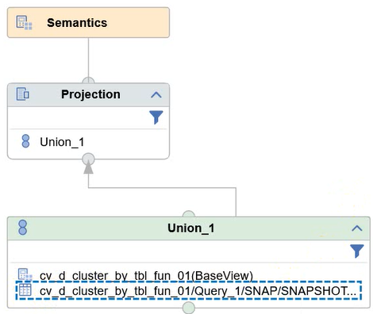

# Cluster-Analysen mit Calculation Views - Tabellenfunktionen, Snapshotbildung und Window-Functions

In SQLScript implementierte Machine-Learning-Logik lässt sich durch die Verwendung von Tabellenfunktionen in Calculation Views integrieren. Mithilfe der neuen Snapshot-Funktion für Calculation Views im Business Application Studio lassen sich die Ergebnisse der Machine-Learning-Ausführung speichern und für fortgeschrittene Analysen in Calculation Views verwenden.
Das Vorgehen zeige ich anhand einer Segmentierung von Kundendaten unter Verwendung der PAL-Prozedur für den Cluster-Algorithmus K-Means. 

*Hinweis*: Das hier gezeigte Vorgehen habe ich in einer Live-Demo auf der HANA Tech Night im Juni 2024 vorgestellt, siehe: https://www.brandeis.de/blog/events/htn-10-recap.

<!-- Start Document Outline -->

* [Neue Funktionen in Calculation Views und Architektur-Skizze](#neue-funktionen-in-calculation-views-und-architektur-skizze)
* [Implementierung der Tabellenfunktion mit der Cluster-Logik](#implementierung-der-tabellenfunktion-mit-der-cluster-logik)
* [Integration der Tabellenfunktion im Calculation View](#integration-der-tabellenfunktion-im-calculation-view)
* [Verwendung der Snapshot-Funktion](#verwendung-der-snapshot-funktion)
	* [Aktivieren der Snapshot-Funktion](#aktivieren-der-snapshot-funktion)
	* [Struktur des Interface-Views und Parameterübergabe](#struktur-des-interface-views-und-parameterübergabe)
	* [Erzeugte Objekte in der Datenbank](#erzeugte-objekte-in-der-datenbank)
* [Integration in einen Cube Calculation View zur weiteren Analyse](#integration-in-einen-cube-calculation-view-zur-weiteren-analyse)
	* [Streudiagramm und Window-Functions](#streudiagramm-und-window-functions)
* [Fazit und Ausblick](#fazit-und-ausblick)

<!-- End Document Outline -->

*Hinweis*: Mein GitHub-Repository https://github.com/drabap/CalcViewClustering enthält die Tabellenfunktion für die Cluster-Logik und einen einfachen Calculation View. Damit können Sie die Beispiele in diesem Blog nachvollziehen.

## Neue Funktionen in Calculation Views und Architektur-Skizze

*Motivation*: Eine Cluster-Analyse erlaubt es, Strukturen und Zusammenhänge in Daten zu erkennen. In dem hier betrachteten Beispiel wird eine Menge von Kundendaten segmentiert. Damit lassen sich etwa interessanten Kundengruppen identifzieren.

Folgende Funktionen, die mit der Modellierung von Calculation Views im Business Application Studio zur Verfügung stehen, erweisen sich in diesem Zusammenhang als nützlich und werden in diesem Blog genutzt bzw. gezeigt:

- Tabellenfunktionen mit tabellarischem Eingabeparameter (bereits in Web IDE, aber nicht Eclipse)
- Snapshotbildung
- Window Functions


Die Architektur sieht so aus:


In der Architekturskizze sieht man die folgenden Bestandteile:

- Eingabedaten: Die Daten, die als Input für die Cluster-Analyse verwendet werden sollen. In unserem Fall also die Kundendaten.
- Tabellenfunktion: Diese Funktion implementiert die Cluster-Logik und gibt die Cluster-Zuweisungen in einer Tabelle zurück.
- Base Calculation View - Cluster-Ergebnisse: Dieser Calculation View ruft die Tabellenfunktion auf und stößt somit die Ausführung der Cluster-Prozedur an.
- Snapshot Table : Generierte Tabelle zum Speichern eines Snapshots des Base Calculation Views. Hier werden die Ergebnisse der Cluster-Zuweisung gespeichert.
- Snapshot Procedure: Generierte Prozedur zur Ausführung des Base Calculation Views und Speichern der Ergebnisse.
- Interface Calc View: Generierter View, der sowohl Zugriff auf den Base View gibt (für eine Ad-Hoc-Ausführung der Cluster-Analyse) als auch den Snapshot.
- Cube Calculation View - Auswertung: In diesem Calculation View werden die Cluster-Zuweisungen (aus Snapshot oder Base View) mit den Kundenattributen angereichert. Dieser View ermöglicht somit die weitere Analyse der Cluster-Ergebnisse im Kontext der Kundenattribute. 

## Implementierung der Tabellenfunktion mit der Cluster-Logik

Zunächst implementiere ich die Tabellenfunktion für die Ausführung der Cluster-Logik. Als Eingabeparameter kann man Hyperparameter des Cluster-Algorithmus vorsehen. Zur Vereinfachung betrachte ich nur die zwei Hyperparameter:
- *I_GROUP_NUMBER*: Anzahl der zu bildenden Cluster/Gruppen
- *I_NORMALIZATION*: Reskalierung der Eingabedaten.

Mit den Eingabeparametern wird zunächst eine Parameter-Tabelle (```lt_parameter```) aufgebaut, die die Parameterwerte enthält. Diese wird zusammen mit den Eingabedaten (```lt_customer``` - den Kundendaten für die Segmentierung) an die PAL-Prozedur des Cluster-Algorithmus übergeben:

```sql
CALL _SYS_AFL.PAL_KMEANS(:lt_customer, 
                         :lt_parameter, 
                         lt_result, 
                         lt_centers, 
                         lt_model, lt_statistics, lt_placeholder);
```


Die Rückgabetabelle der Tabellenfunktion soll die folgenden Spalten enthalten:
- *CUSTOMERID* : Kundennummer zur eindeutigen Identifizierung des Quellsatzes.
- *DISTANCE*: Abstand der Datensatzes zum zugeordneten Cluster-Zentrum.
- *CLUSTER_ID*: Nummer des zugeordneten Cluster.

Die Rückgabe wird aus der Tabellenvariable ```lt_result``` aufgebaut:
```sql
return select customerid,
              distance, 
              cluster_id
        from :lt_result;
```

Den vollständigen Quelltext der Tabellenfunktion finden Sie im schon erwähnten GitHub-Repository: https://github.com/drabap/CalcViewClustering/blob/main/db/src/tbl_fun_cluster_tab_input_inp_par.hdbfunction.

Für eine Übersicht der möglichen Hyperparameter und die Details zur Implementierung in SQLScript verweise ich auf mein Buch "Machine Learning mit SAP HANA" (https://es-tu.de/e9ZD2)


## Integration der Tabellenfunktion im Calculation View 

Eine Tabellenfunktion lässt sich direkt in einem Calculation View als Datenquelle verwenden. In der web-basierten Modellierung gibt es einen eigenen Knotentyp "Table Function", der sogar Tabellenfunktionen mit tabellarischem Eingabeparameter unterstützt. 
In unserem Beispiel wird die Tabellenfunktion ```TBL_FUN_CLUSTER``` dem Knoten TableFunction_1 hinzugefügt.

Die Eingabedaten für das Clustering werden über einen Projektionsknoten versorgt. Dieser selektiert aus der Tabelle CHURN (beinhaltet die Kundendaten):


Auf dem Reiter "Input Mapping" werden die Spalten des Projektionsknoten (Tabelle CHURN) auf die Spalten des Eingabeparameters *IT_INPUT* der Tabellenfunktion gemappt:


Auf dem Reiter Parameters des Knotens TableFunction_1 lassen sich aus den skalaren Eingabeparametern der Tabellenfunktion direkt Eingabeparameter für den Calculation View erstellen:


Nach den üblichen Modellierungsschritten (Hinzufügen von Feldern in der Ausgabe, etc.) lässt sich der Calculation View ausführen im Data Preview:

Nach Eingabe der Parameter ...


... wird die Cluster-Logik ausgeführt:


Während die direkte Ausführung hilfreich beim Ausprobieren ist, hat sie den Nachteil, dass die gesamte Cluster-Logik bei jedem Navigationsschritt in der Datenvorschau erneut durchlaufen wird. Dies wirkt sich nachteilig auf Laufzeit und Ressourcenverbrauch aus. Außerdem beinhaltet der Cluster-Algorithmus zufällige Elemente, z.B. die Initialisierung der Cluster-Zentren. Dies kann dazu führen, dass man bei jeder Ausführung ein anderes Ergebnis erhält.

Hier kommt die neue Snapshot-Funktion ins Spiel, die ich nun betrachte.

## Verwendung der Snapshot-Funktion

Die Snapshot-Funktion wurde vor einigen Releases in der Modellierung mit Business Application Studio (BAS) eingeführt. Grundgedanke ist es, die Ergebnismenge von auf dem Calculation View definierten Queries in einer Tabelle zu speichern und diese Ergebnisse zur späteren Verwendung bereit zu stellen.

### Aktivieren der Snapshot-Funktion

Die Snapshot-Funktion wird im Semantik-Knoten aktiviert. Man kann eine oder mehrere Queries definieren. Da der hier vorliegende Calculation View ein simpler Dimension-View ohne Aggregation ist, machen wir ein einfaches SELECT-Statement mit vollständiger Projektionsklausel. Die Queries werden im Reiter *Snapshots* im Semantikknoten definiert:


Folgende wichtige Punkte sieht man hier:

- Der Snapshot wird über eine SQL-Query definiert. Bei der Verwendung von Eingabeparametern ist es wichtig, diese explizit in der SQL-Query anzugeben. Dadurch werden die Eingabeparameter auch von den generierten Prozeduren zum Verwalten des Snapshots exponiert.
- Es wird ein Interface-View (Feld Interface View Name) generiert. Dieser erlaubt sowohl den Zugriff auf die im Snapshot gespeicherten Daten als auch den zugrunde liegenden Basis-View.
- Mit der Option "Create Snapshot After Deployment Automatically" kann man die Snapshotbildung beim Deployen des Views anstoßen. Das ist insbesondere in der iterativen Entwicklung hilfreich.

Im Backend wird eine Tabelle erzeugt zum Speichern des Snapshots. Wie man diese mithilfe des Interface-Views ausliest, zeige ich im nächsten Abschnitt.

### Struktur des Interface-Views und Parameterübergabe

Der automatisch erzeugte Interface-View wird vom BAS als Design-Time-Objekt erstellt und lässt sich somit in weitere eigene Calculation-Views integrieren.



Der Interface View besteht aus einem Union der Snapshottabelle und dem ursprünglichen Calculation View.
Der Interface View besitzt den Eingabeparameter *I_SOURCE*. Dieser erlaubt es, zur Laufzeit die Datenquelle zu bestimmen:
- *BASE*: Selektion aus dem Basis-View.
- *SNAPSHOT*: Lesen des Snapshots.

In unserem Szenario entspricht *BASE* also der Ad-Hoc-Ausführung der Cluster-Logik während *SNAPSHOT* dem Auslesen der Cluster-Zuordnung aus einem vorherigen Lauf entspricht.

Mit diesem Eingabeparameter findet eine Filterung auf die Eingabeknoten des Union-Knoten statt. Durch das *UNION-Pruning* ist gewährleistet, dass immer nur *einer* der beiden Eingabeknoten ausgeführt wird.

Damit auch die Eingabeparameter der Tabellenfunktion vom Interface-View versorgt werden können, müssen diese manuell im Interface-View gemappt werden. Hier ist zu beachten, dass eine Anpassung eines generierten Objektes stattfindet. Bei einer Änderung der Snapshot-Query und einer Neuerzeugung des Interface-Views sind diese Anpassungen somit zu wiederholen:


Um auch beim Auslesen des Snapshots die Eingabeparameter zu berücksichtigen, habe ich folgenden Trick angewandt:
- Die Rückgabe des Basis-View (Aufruf der Tabellenfunktion) enthält die Eingabeparameter als konstante Spalte.
- Im Projektionsknoten des Interface-View habe ich einen Filterausdruck für diese Spalten mit den aktuellen Werten der Eingabeparameter definiert:


Hier der Filter-Ausdruck als Code-Snippet:
```sql
"COL_GROUP_NUMBER" = $$I_GROUP_NUMBER$$
and "COL_NORMALIZATION" = $$I_NORMALIZATION$$
```
Durch den Filterausdruck wird gewährleistet, dass nur derjenige Snapshot gelesen wird, der zu den Eingabeparametern passt.
Beim Aufruf des Base-View hat der Filter keine Wirkung, da der Base-View die Werte der Eingabeparameter in den beiden Spalten zurück liefert.

Betrachten wir den Interface-View in der Datenvorschau. Wir rufen den Interface-View mit der Parameterwahl *I_SOURCE* = *SNAPSHOT* und den Standardwerten *I_GROUP_NUMBER* = 5 und *I_NORMALIZATION* = 0 auf, die in der definierenden Query angegeben waren:


Mit dieser Wahl erhalten wir die Zeilen aus dem Snapshot, der beim Deployment automatisch angelegt wurde:


Wie man nach dem Deployment Snapshots von weiteren Ausführungen in der Tabelle speichern kann, zeige ich im nächsten Abschnitt.


### Erzeugte Objekte in der Datenbank

Durch die Snapshot-Funktion werden folgende Objekte angelegt (zusätzlich zu den Column Views der Calculation Views):

- Snapshottabelle für das Speichern des Snapshots
- Prozeduren zum Verwalten des Snapshots.

Die Snapshottabelle hat als Struktur die Feldliste der definierenden Query:


Neben den Spalten der Rückgabe der Tabellenfunktion sind die zwei konstanten Spalten für die Eingabeparameter zu sehen (*COL_GROUP_NUMBER* und *COL_NORMALIZATION*).
Wie oben erwähnt, habe ich für diese Spalten einen Filterausdruck im Interface-View manuell eingefügt.

Die folgenden Prozeduren werden angelegt:


- CREATE: Neuanlage und Befüllen der Snapshottabelle (nach Löschen) 
- INSERT: Einfügen eines neuen Snapshots in der Tabelle
- DROP: Löschen der Snapshottabelle
- SELECTIVE_DELETION: Selektives Löschen von Snapshot-Einträgen mittels dynamischen Filter (*neu* im September-Release 2024)
- TRUNCATE: Truncate der Snapshottabelle (Löschen + Commit)

Ein beispielhafter Ablauf könnte so aussehen:
- Mit der *INSERT*-Prozedur werden weitere Durchläufe des Cluster-Algorithmus mit unterschiedlichen Eingabeparametern ausgeführt.
- Mit der *DROP*-Prozedur wird die Snapshottabelle bei Bedarf komplett gelöscht und kann mit der *CREATE*-Prozedur neu aufgebaut werden.

Denkbar wäre auch, die *INSERT*-Prozedur regelmäßig auszuführen, etwa über ein Scheduling in der SAP HANA. Über die SELECT_DELETION-Prozedur können dann alte Snapshots gezielt entfernt werden.

In diesem Screenshot ist die Signatur der *INSERT*-Prozedur zu sehen:


Wie man sieht, werden die beiden Eingabeparameter der Tabellenfunktion bzw. des Calculation Views angeboten. Somit können mehrere Cluster-Durchläufe mit unterschiedlichen Parameterwerten ausgeführt und im Snapshot gespeichert werden.

Führen wir die *INSERT*-Prozedur nun für die neue Parameterkombination *GROUP_NUMBER* = 5 und *NORMALIZATION* = 2 aus, so sehen wir in der Snapshottabelle nun auch Sätze für die neue Parameterkombination:

```sql
CALL "HANA_CLUSTER_TABLE_FUNCTION_CALC_VIEW_HDI_DB_1".  
"cv_d_churn_cluster_tab_function_base/Query_1/SNAP/SNAPSHOT/INSERT"(I_GROUP_NUMBER => 5 ,
I_NORMALIZATION => 2)
```


Die Anzahl der Sätze von 6383 je Kombination entspricht genau der Anzahl der selektierten Kunden für die Cluster-Ausführung (Kunden mit BALANCE = 0 wurden ausgeschlossen).


# Integration in einen Cube Calculation View zur weiteren Analyse

Um die Ergebnisse des Cluster-Algorithmus interpretieren zu können, müssen die Cluster-Zuordnungen der einzelnen Kunden in Bezug auf die Eingabedaten, den Attributen der Kunden, gesetzt werden. Dazu integriere ich den Interface-View in einen Calculation View vom Typ *Cube*. Die Verwendung des Interface-View erlaubt es, die weiterführenden Analysen sowohl mit Daten aus dem Snapshot als auch mit einer Ad-Hoc-Ausführung der Cluster-Logik durchzuführen und dabei den gleichen Calculation View zu verwenden. 

Der Calculation View zur Analyse ist so aufgebaut:

- Über Projektionsknoten werden jeweils die Kundendaten (*CHURN*) und der Interface-View integriert.
- Die beiden Datenquellen werden über einen JOIN entlang der Kundennummer (Spalte CUSTOMERID) verknüpft.
- Im obersten Aggregationsknoten wird ein Zähler für die Kunden definiert.

So sieht die Struktur des Calculation Views aus:


Im Semantikknoten werden folgende Einstellungen vorgenommen:
- Die Eingabeparameter des Interface-View werden über das "Parameter Mapping" als Eingabeparameter im Calculation View verfügbar gemacht.
- Die numerischen Attribute der Kunden werden als Kennzahl definiert, die textartigen Attribute oder numerische Attribute, die als kategoriales Merkmal betrachtet werden sollen, werden als Merkmal definiert.

In der Datenvorschau hat man nun die Wahl zwischen Snapshot oder Basis-View:


Aggregiert man die Kennzahl *COUNT_CUSTOMER* nach den Clustern, kann man die Anzahl der Kunden pro Cluster zählen:


Mit den numerischen Attributen der Kunden lässt sich nun ein Blasendiagramm zeichnen, um die Lage der Clusterzentren einzuschätzen. Als Aggregationsfunktion wählen wir *AVG* (Durchschnitt):


Die Größe der Blasen wird durch die Anzahl der Kunden je Cluster bestimmt:


## Streudiagramm und Window-Functions

Der Cube-Calculation-View lässt sich nun beliebig erweitern, um komplexere Auswertungen der Kundenstruktur nach den Clustern vorzunehmen. Hilfreich erweist sich hier auch der neue Knotentyp *Window Function* im BAS.

Der Knotentyp *Window Function* kann beispielsweise für folgendes Szenario verwendet:

Streudiagramm nach Kunden mit Random Sampling:

- Nimmt man im obigen Beispiel zusätzlich zur CLUSTER_ID die Kundennummer (CUSTOMER_ID) in den Aufriss, erhält man ein Streudiagramm mit allen Kunden, eingefärbt nach der Cluster-Zuweisung. 
- Dadurch enthält die Ergebnismenge aber eine sehr große Anzahl an Datensätzen - jeder Punkt entspricht im Streudiagramm einem Kunden.
- Durch die Window-Function *Random partition* lässt sich nun pro Cluster eine zufällige Stichprobe ziehen. Dies reduziert die Anzahl der Datensätze im Ergebnis wieder und erlaubt es, trotzdem die Form der Cluster einzuschätzen.

Hierzu wird der Calculation View folgendermaßen erweitert: Oberhalb des JOIN-Knotens wird ein Knoten "Window Function" eingefügt:


Im Knoten wird die Window Function "Random Partition" gewählt.

Diese Window Function wird verwendet, um eine Datenmenge in zwei oder drei zufällige Teilmengen zu unterteilen. Diese Funktion wird eigentlich beim beaufsichtigen Lernen (z.B. bei Klassifikationsproblemen) verwendet. Wir nutzen sie hier, um eine Teilmenge der Ergebnismenge zu erhalten:


Die Funktionsweise ist folgendermaßen: Es wird eine Spalte *WIN_FUNC_PARTITION* angelegt. Jeder Datensatz wird zufällig der Teilmenge "Training Set" (80%) oder der Teilmenge "Validation Set" (20%) zugeordnet. Die Zuordnung ist über die Ausprägung der Spalte *WIN_FUNC_PARTITION* erkennbar.
Um das Random Sampling pro Cluster durchzuführen, muss die Spalte *CLUSTER_ID* der Partition zugeordnet werden:


Dieses Vorgehen nennt man auch *stratified sampling*.

Aggregation nach *CLUSTER_ID* zeigt, dass pro Cluster ca. 80% der Datensätze  der Menge 1 (Training) und 20% der Datensätze der Menge 2 (Validation) zugeordnet werden:


Im Streudiagramm kann nun nach Kunde aufgerissen werden und zusätzlich nach der Teilmenge, z.B. der 20%-Teilmenge, gefiltert werden:


Zum Vergleich das Streudiagramm ohne Filterung:


# Fazit und Ausblick

In diesem Blog habe ich gezeigt, wie man unter Verwendung von SQLScript mit Tabellenfunktionen Machine-Learning-Logik in Calculation Views integrieren kann.
Die Verwendung der neuen Snapshot-Funktion erlaubt es, das Ergebnis der Cluster-Ausführung für spätere Analysen zu speichern. Dadurch lassen sich mit *einem* Modellierungswerkzeug die beiden Szenarien Ad-Hoc-Ausführung und Batch-Ausführung der Machine-Learning-Logik kombinieren. Neue Modellierungsfunktionen der Calculation Views im Business Application Studio, wie z.B. Window Functions, erlauben weiterführende Analysen.

Integriert man den Calculation View in der SAP Analytics Cloud lassen sich die Cluster-Ergebnisse durch Reporting-User verwenden. Die Prozeduren für die Snapshotverwaltung können manuell ausgeführt oder über Scheduling Services in SAP HANA eingeplant werden. 


