# Cluster-Analysen im SQL-Notebook und Visualisierung mit Calculation Views

Mit dem SQL-Notebook im Business Application Studio kann man interaktiv SQL-Statements oder Blöcke von SQLScript ausführen. Das lässt sich vielfältig nutzen, etwa zur Datenanalyse, als interaktive Read-Me-Datei oder für Setup-Instruktionen eines SAP-HANA-Projektes in CAP.
In diesem Blog zeige ich die Ausführung einer Cluster-Analyse in einem SQL-Notebook. Die Ergebnisse werden in einer Tabelle gespeichert und können anschließend mit Calculation Views visualisiert werden. Anschließend skizziere ich die Verwendung von HDI-Containern und die Rolle des Space-Konzeptes von SAP HANA im Kontext von Machine Learning.


<!-- Start Document Outline -->

* [SQL-Notebook](#sql-notebook)
   * [Cluster-Analyse in SQLScript](#cluster-analyse-in-sqlscript)
   * [Statistische Berechnungen](#statistische-berechnungen)
   * [Einschub: KI-gestützte Intepretation](#einschub-ki-gestützte-intepretation)
* [Visualisierung in Calculation Views](#visualisierung-in-calculation-views)
* [Architektonische Betrachtungen - Data Spaces und HDI Container in SAP HANA](#architektonische-betrachtungen---data-spaces-und-hdi-container-in-sap-hana)
* [Zusammenfassung](#zusammenfassung)
* [Referenzen](#referenzen)

<!-- End Document Outline -->


Zunächst möchte ich das Vorgehen motivieren:

- *SQL-Notebook als Erweiterung der klassischen SQL-Konsole*: Im SQL-Notebook können die Ausgaben von mehreren Befehlen gespeichert werden, während man in der SQL-Konsole immer nur das Ergebnis der letzten Ausführung sieht.
- *SQLScript für Datenanalysten*: Datenanalysten arbeiten gerne mit SQLScript (neben Python). Das SQL-Notebook erlaubt es, verschiedene Analyse-Skripte strukturiert und gegliedert in einer Datei im Code-Repository zu speichern - ohne Prozeduren oder Tabellenfunktionen anlegen zu müssen. 
- *Zusammenspiel mit Calc Views*: Mit Calculation Views und der Datenvorschau im Database Explorer (oder einem BI-Tool) können vielfältige  Visualisierungen des Ergebnis der Datenanalyse erstellt werden.

## SQL-Notebook

Für die Nutzung eines SQL-Notebooks benötigen Sie ein SAP-HANA-Projekt im Business Application Studio (oder in SAP Build). Ein SQL-Notebook wird als Datei mit der Endung "notebook" angelegt.

Ein SQL-Notebook besteht aus mehreren Blöcken verschiedenen Typs:

- Connection Management: Zum Anzeigen der verfügbaren Verbindungen und Auswählen einer Verbindung zur HANA-Datenbank
- Markdown-Block: Enthält Text in Markdown. Für Überschriften oder Erläuterungen
- SAP HANA SQL: Enthält SQL- oder SQLScript-Anweisungen und erlaubt deren Ausführung. 

Zunächst wird ein Block vom Typ Connection Management angelegt. In diesem Block wird der Befehl `#List database connections` eingetragen. Nach Ausführung werden die verfügbaren Verbindungen angezeigt. Das SQL-Notebook liest hierzu die Verbindungen, die dem Cloud-Foundry-User zugewiesen sind, aus:

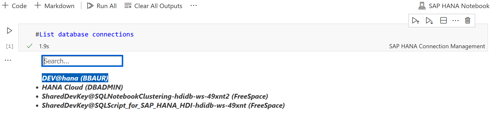

Dies sind die gleichen Verbindungen, die Ihrem Cloud-Foundry-Nutzer im Database Explorer der HANA Cloud zugewiesen sind.

In unserem Szenario sieht man:
- zwei Verbindungen zu HDI-Containern (erkennbar an *SharedDevKey*),
- eine on-Premise-Verbindung zu HANA Express
- eine native Verbindung zur HANA Cloud (mit Datenbankuser *DBADMIN* ohne HDI-Container). 
Mit Auswahl einer Verbindung wird die Verbindung zur HANA aufgebaut.

:nerd_face: Auch wenn das SQL-Notebook ein Cloud-Tool ist, kann man sich zu einer on-Premise HANA-Instanz verbinden.

Zur Bestätigung kann man mit dem Befehl `#Show current database connection` die aktuelle Verbindung zur HANA anzeigen:

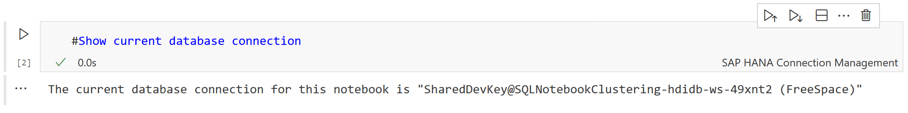

Jetzt kann man loslegen und erste SQL-Befehle ausführen. Für die Cluster-Analyse verwende ich - wie auch in meinem Buch - die Datenmenge CHURN (siehe [^churn]). Diese enthält 10.000 Datensätze von fiktiven Kunden einer Bank. Ursprünglich gedacht für die Entwicklung eines Prognosemodells zum Kündigungsverhalten, verwende ich diese hier zur Veranschaulichung einer Cluster-Analyse.

Beginnen wir mit einem einfachen Select-Statement. Fügen Sie hierzu einen Block vom Typ "SAP HANA SQL" ein:

```sql
SELECT * FROM CHURN
```

Als Ergebnis erhält man die Tabelle beschränkt auf die ersten Zeilen:

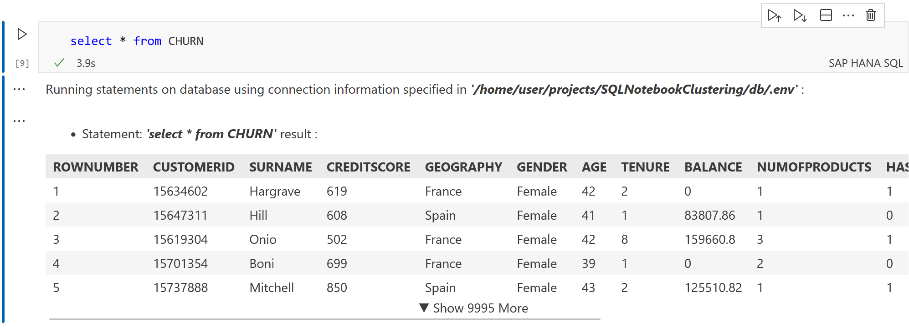

Möchte man eine zufällige Stichprobe auswählen, kann man auch den Befehl ergänzen:

```sql
SELECT * FROM CHURN ORDER BY rand() limit 5
```
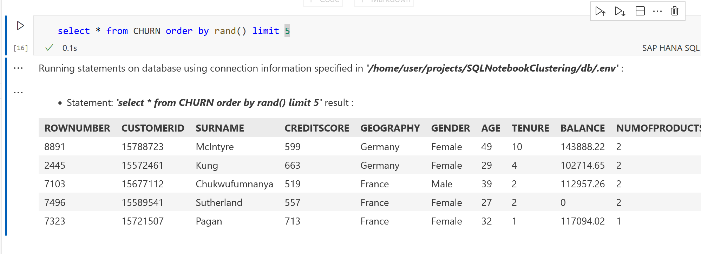

### Cluster-Analyse in SQLScript

Auf Basis der Tabelle CHURN führen wir nun die Cluster-Analyse durch. Mit einer Cluster-Analyse werden die Kunden segmentiert in Gruppen ähnlicher Kunden.
Für die Cluster-Analyse verwende ich den K-Means-Algorithmus, bereit gestellt durch die PAL-Prozedur `_SYS_AFL.PAL_KMEANS`.
Das Vorgehen ist drei geteilt:

- Aufbau der Parameter-Tabelle für die KMeans-Prozedur
- Aufruf der Prozedur
- Speichern der Cluster-Zuweisung in einer (container-lokalen) Tabelle

Diese Logik muss nun in einem anonymen Block gekapselt werden. Ich verwende hier den Quellcode aus meinem Buch "Machine Learning mit SAP HANA" (Espresso Tutorial, 2022, [^thebook]). Für die technischen Details empfehle ich die Lektüre meines Buches.

Betrachten wir den Ausschnitt zum Aufbau der Parameter-Tabelle:
```sql
DO BEGIN
-- Auslassung: Definition von :lt_parameter 
...

INSERT INTO :lt_parameter VALUES ('GROUP_NUMBER', 5, NULL, NULL);
INSERT INTO :lt_parameter VALUES ('INIT_TYPE', 1, NULL, NULL);
INSERT INTO :lt_parameter VALUES ('DISTANCE_LEVEL',2, NULL, NULL);
INSERT INTO :lt_parameter VALUES ('THREAD_RATIO', NULL, 0.1, NULL);

-- Zu Testzwecken: Ausgabe
SELECT * FROM :lt_parameter;

END;
```

Ausführung liefert:
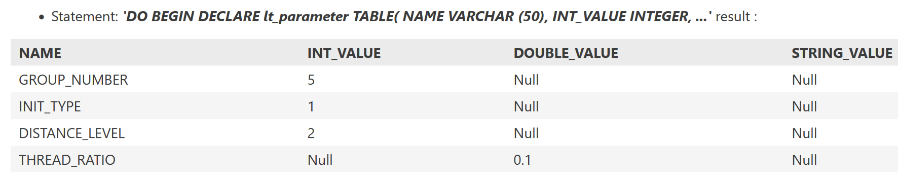

Mit einem SELECT-Statement selektieren wir die relevanten Spalten, die als Eingabe-Features für das Clustering gewählt werden sollen. Unterschiedliche Auswahl der Features führt zu unterschiedlichen Cluster-Ergebnissen.
Zugleich erweitern wir den anonymen Block um den Aufruf der Cluster-Prozedur:
```sql
lt_churn = SELECT CUSTOMERID,
				  GEOGRAPHY,
				  AGE,
				  TENURE,
				  BALANCE,
				  NUMOFPRODUCTS,
				  ESTIMATEDSALARY
				  FROM CHURN WHERE BALANCE > 0;


CALL _SYS_AFL.PAL_KMEANS(:lt_churn, 
                          :lt_parameter, 
                          lt_result, 
                          lt_centers, 
                          lt_model, 
                          lt_statistics, 
                          lt_placeholder);
```
Die Cluster-Zuweisung wird in ```lt_result``` ausgegeben, die Cluster-Zentren in ```lt_centers```.
Durch das Anfügen eines Select-Befehls im anonymen Block wird nach Ausführung die Cluster-Zuweisung ausgegeben:
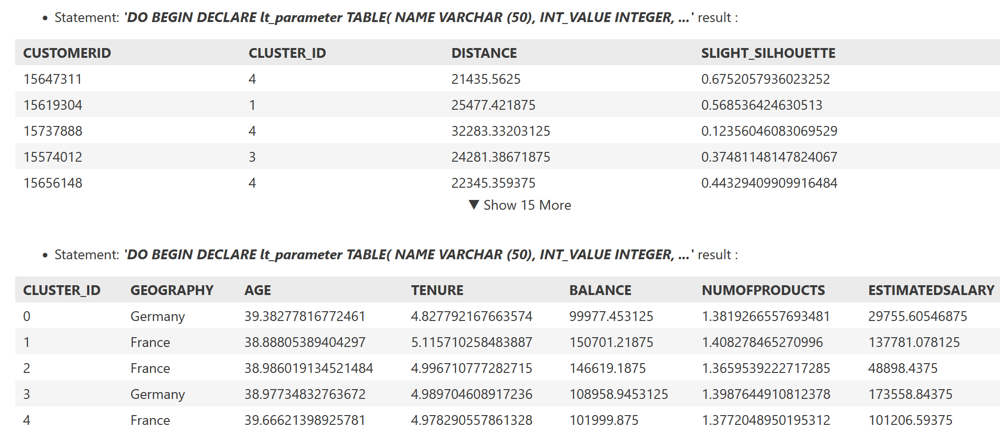

Um die Cluster-Zuweisung für weitere Analysen zu verwenden, speichern wir diese nach Ausführung in der (container-lokalen) Tabelle ```CLUSTER_RESULT```.

:💡 : Unterschied Python und SQL-Notebook

Anders als im Jupyter Notebook für Python, werden in einem SQL-Notebook keine lokalen Variablen definiert. Die Blöcke bilden voneinander unabhängige Einheiten, die nur die gemeinsame Datenbankverbindung nutzen.
Ein Informationsaustausch zwischen den Blöcken ist somit nur über Session-Variablen oder temporäre Tabellen möglich. In dem hier gezeigten Beispiel verwende ich eine persistente Tabelle ```CLUSTER_RESULT```, die ich in einem HANA-Projekt als *hdbtable*-Datei definiert habe. Diese wird dann als container-lokale Tabelle deployed.

### Statistische Berechnungen 
Um die Verteilung der numerischen Attribute nach Cluster genauer zu analysieren, kann man Mittelwerte und  Perzentile berechnen. Die Perzentile lassen sich in SQLScript als Window-Expression mit der Window-Aggregations-Funktion ```percentile``` berechnen.
Der folgende Code-Block selektiert zunächst das Ergebnis der Cluster-Analyse mit ```RUN_ID = 1 ``` und führt dann die Percentile-Berechnung durch:
```sql
DO BEGIN 

lt_customer_cluster = SELECT c.customerid, 
                             r.cluster_id, 
                             c.age, 
                             c.balance FROM CHURN as c JOIN cluster_result as r on c.CUSTOMERID = r.CUSTOMERID
                             where r.RUN_ID = 1;

lt_percentile = SELECT customerid, cluster_id, age, balance,
    PERCENTILE_CONT(0.25) WITHIN GROUP (ORDER BY age) OVER (PARTITION BY cluster_id) AS age_p25,
    PERCENTILE_CONT(0.50) WITHIN GROUP (ORDER BY age) OVER (PARTITION BY cluster_id) AS age_p50, 
    PERCENTILE_CONT(0.75) WITHIN GROUP (ORDER BY age) OVER (PARTITION BY cluster_id) AS age_p75, 
    PERCENTILE_CONT(0.25) WITHIN GROUP (ORDER BY balance) OVER (PARTITION BY cluster_id) AS balance_p25,
    PERCENTILE_CONT(0.50) WITHIN GROUP (ORDER BY balance) OVER (PARTITION BY cluster_id) AS balance_p50,
    PERCENTILE_CONT(0.75) WITHIN GROUP (ORDER BY balance) OVER (PARTITION BY cluster_id) AS balance_p75 from :lt_customer_cluster;
     

SELECT cluster_id, max(age_p25) as age_p25, 
                   max(age_p50) as age_p50,
                   max(age_p75) as age_p75, 
                   avg(age) as mean_age,
                   max(balance_p25) as balance_p25, 
                   max(balance_p50) as balance_p50, 
                   max(balance_p75) as balance_p75,
                   avg(balance) as mean_balance
                   FROM :lt_percentile group by cluster_id order by cluster_id;


END;
```

Ergebnis:
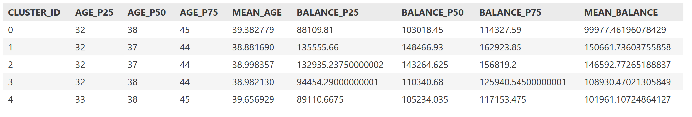

💡  Die Percentile-Cont-Funktion ist eine sogenannte *Window Aggregate function*: Innerhalb der definierten Partition (hier die Cluster) wird eine Aggregation berechnet und der aggregierte Wert an jede Zeile der Partition geschrieben. Die Percentile-Funktionen stehen aber nicht bei einer gewöhnlichen Aggregation mit einem ```Group By```-Statement zur Verfügung.

- Das Ergebnis lässt sich folgendermaßen interpretieren: Die Altersverteilung unterscheidet sich nicht zwischen den Clustern (die mittleren 50% liegen im Bereich 32 - 45). 
- Die Verteilung für Balance (Kontostand) unterscheidet sich zwischen den Clustern:
  - Cluster *0* und *4* enthalten die Kunden mit niedrigeren Kontoständen.
  - Cluster *1* und *2* enthalten Kunden mit höheren Kontoständen.

Andere Segmentierungen der Kunden erhält man durch die Reduktion der Eingabedaten auf bestimmte Features oder die Verwendung einer Normalisierung der Features. Im SQL-Notebook (siehe das GitHub-Projekt: [^git] ) ist eine weitere Cluster-Konfiguration aufgeführt, bei der nur nach Alter und Creditscore segmentiert wird und zusätzlich die Eingabevariable vorher normalisiert werden. 

### Einschub: KI-gestützte Intepretation

Beim Schreiben dieses Blogs habe ich - mehr zum Spaß - die nach Cluster aggregierte Ausgabe des vorherigen Abschnitt in Microsoft Copilot als Prompt kopiert. Das kam dabei heraus:

🤓 Die tabellarische Ausgabe der statistischen Kennzahlen können Sie mittels der Funktion "Copy Cell Output" als JSON-Array kopieren. Diese Zeichenkette können Sie 1:1 in Microsoft Copilot eingeben. Microsoft Copilot führt dann eigenständig eine Interpretation der Cluster-Ergebnisse (auf Basis der zusammengefassten statistischen Kennzahlen) durch und erlaubt sogar die Visualisierung der Cluster. 


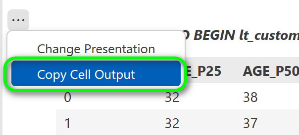

Aufbereitung durch Copilot/ChatGPT:


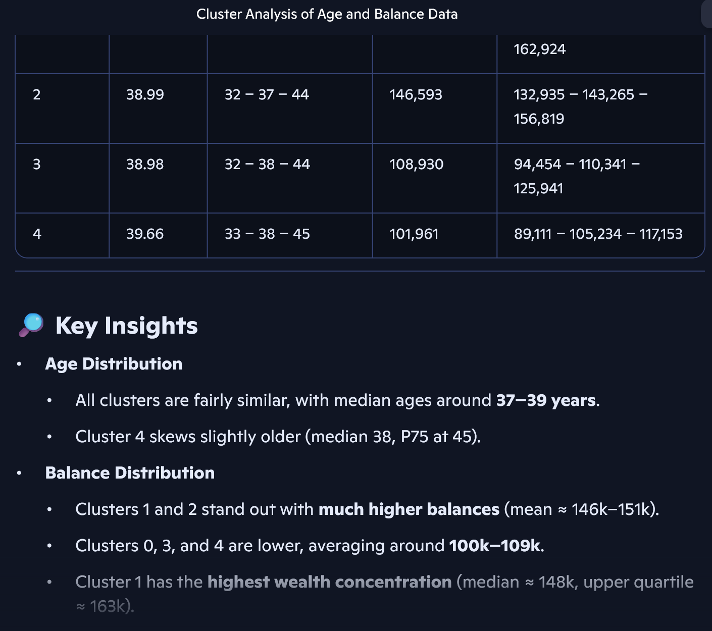

Der Clou: Die statistischen Berechnungen finden bereits (durch Ausführung des SQL-Statements oben) in der SAP HANA statt  - dank In-Memory pfeilschnell. Copilot muss hier nur die berechneten statistischen Kennzahlen verarbeiten, dies entspricht einer hoch aggregierten und folglich sehr kleinen Datenmenge. Insbesondere müssen keine individuellen Kundensätze aus dem SAP-System an Copilot geliefert werden.


## Visualisierung in Calculation Views

Nach dem wir nun via SQLScript die Cluster-Analyse ausgeführt haben, lässt sich diese mittels Calculation Views weiter untersuchen und visualisieren.

In meinem letzten Blog[^blog_calc_views] habe ich bereits einige Visualisierungen gezeigt:

- Blasendiagramm für die Cluster-Zentren
- Streudiagramm mit zufälliger Stichprobe pro Cluster

Die grundlegende Modellierung besteht darin, die Quelltabelle CHURN (mit den Kundendaten) durch einen JOIN mit der Ergebnistabelle für die Clusterzuweisungen *CLUSTER_RESULT* zu verknüpfen.

Die folgende Abbildung zeigt die Grundform des Calculation Views:

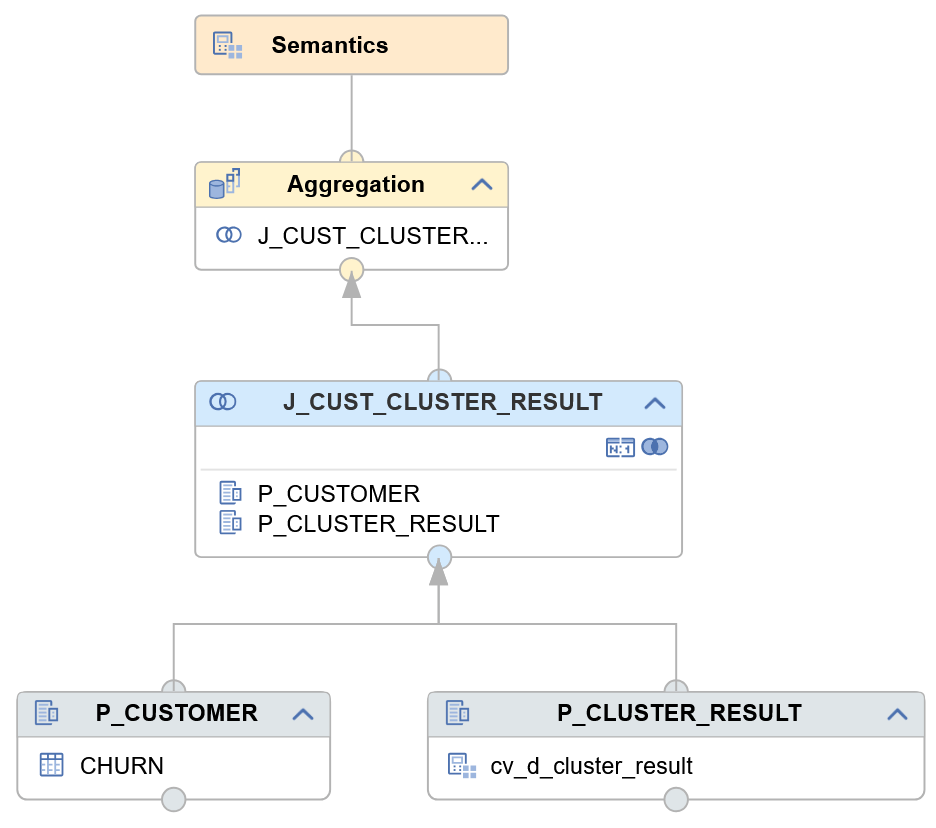

Visualisierung der Cluster-Zentren als Blasendiagramm:


Streudiagramm mit zufälliger Stichprobe pro Cluster:

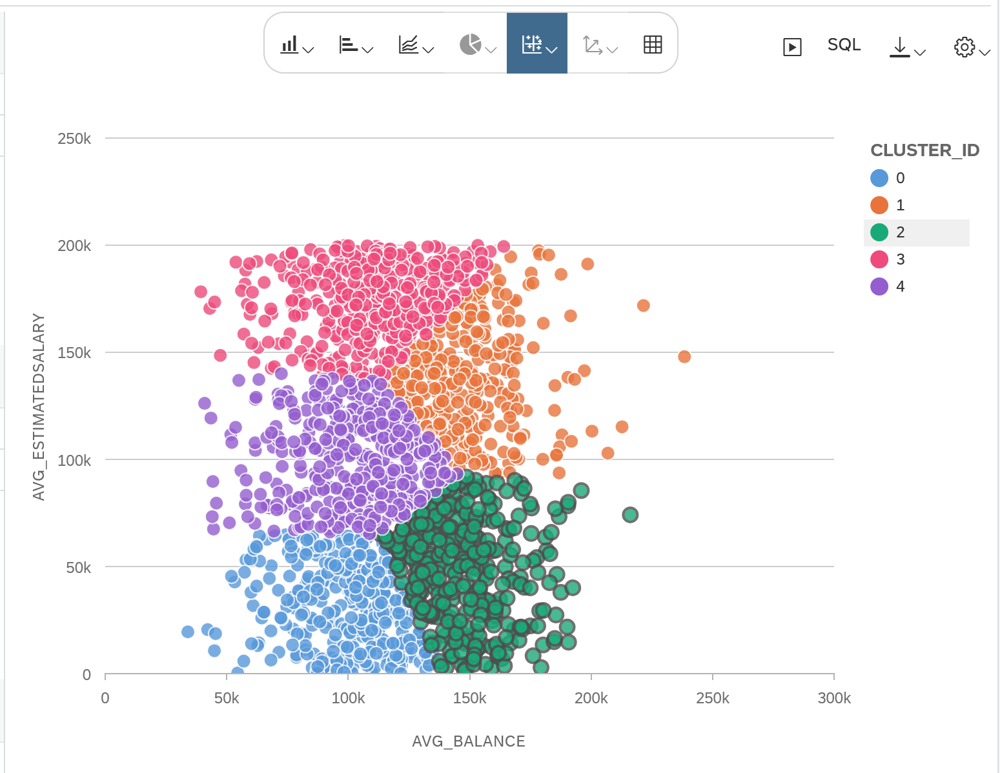

Wie man die zufällige Stichprobe mittels dem Knotentyp Window Function modelliert, habe ich im  letzten Blog[^blog_calc_views] beschrieben.

Ich möchte nun eine weitere hilfreiche Technik für die  Analyse vorstellen, das sogenannte *Binning*: Die Spalte Alter (*AGE*) lässt sich durch die Window Function *NTILE* diskretisieren, d.h. eine kategoriale Spalte erstellen, die jeden Datensatz einem Intervall auf Basis des Alters bzw. jeden Kunden einer Altersgruppe zuweist. Das lässt sich nutzen, um die Verteilung der Kunden in den einzelnen Clustern nach Altersgruppe zu analysieren.

Für die Erstellung der diskreten Spalte *AGE_BIN* erstelle ich den Dimension View *CV_D_AGE_BINNING*, der folgenden Aufbau hat:

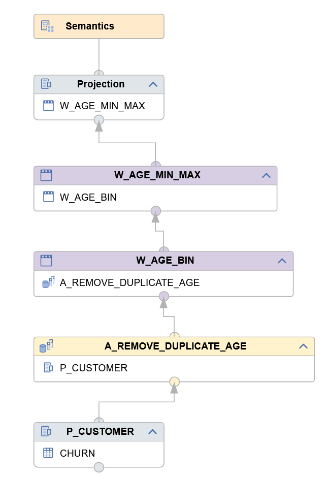{height = 500px}

Die einzelnen Knoten haben folgende Funktion:

- Aggregationsknoten A_REMOVE_DUPLICATE_AGE: Durch Aggregation auf der Spalte AGE (als Aggregationsmerkmal) werden die distinkten Werte der Spalte AGE selektiert. Dies entspricht im SQL dem *SELECT DISTINCT*.
- Window Function Knoten W_AGE_BIN: Verwendung der Funktion *N_TILE* zum Unterteilen des Wertebereichs von *AGE* in Intervalle. Jeder Wert für AGE wird einer Gruppe zugewiesen. Diese Zuweisung bildet die neue Spalte *AGE_BIN*.
- Window Function Knoten W_AGE_MIN_MAX: Berechnet pro Gruppe (*AGE_BIN*) das minimale und maximale Alter.
- Projection: Ausgabe der Spalten und zusätzliche Berechnung der Intervallbeschriftung *AGE_LABEL*.

Die Modellierung der Window Function im Knoten *W_AGE_BIN* sieht so aus:

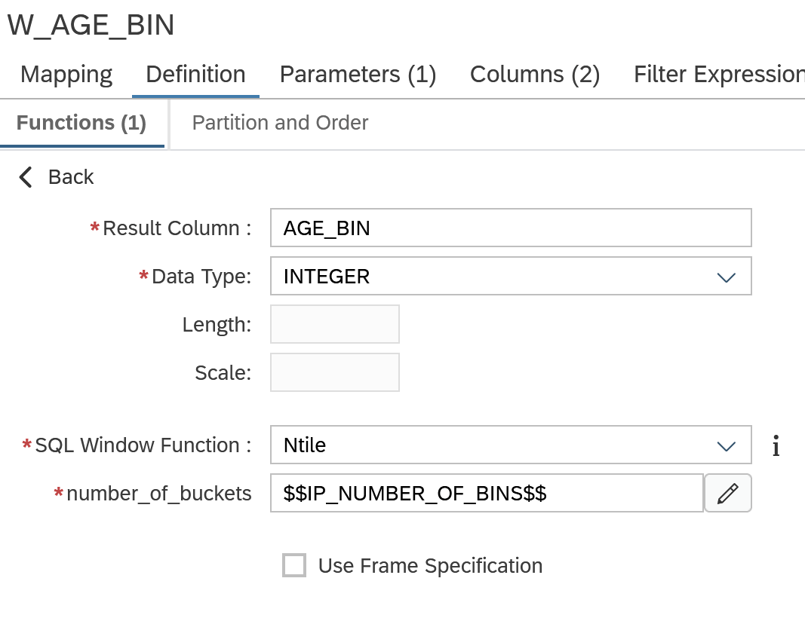


- Die Datensätze werden nach AGE sortiert (im Reiter *Partition and Order* einstellen).
- Die Window Function *Ntile* bildet dann Gruppen der Datensätze entsprechend der Sortierung.
- Die Anzahl der zu bildenden Gruppen wird über die Einstellung *number_of_buckets* definiert. Diese versorgen wir über den Eingabeparameter *IP_NUMBER_OF_BINS*.

Eine Beispielausgabe für *IP_NUMBER_OF_BINS = 10* sieht so aus:

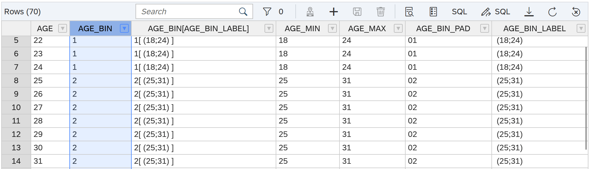

Nun lässt sich der zuvor modellierte Cube View (Verknüpfung von Kundenattributen und Cluster-Zuweisung) um einen Join mit dem Dimension View *CV_D_AGE_BINNING*  erweitern. 
Die Anzahl der Kunden lässt sich nun pro Cluster und Altersgruppe zählen.
Wir betrachten die Visualisierung für *IP_NUMBER_OF_BINS = 5*.

Beispielsweise vergleicht das folgende Balkendiagramm die Altersverteilung in den Clustern *0*,*1* und *3*:

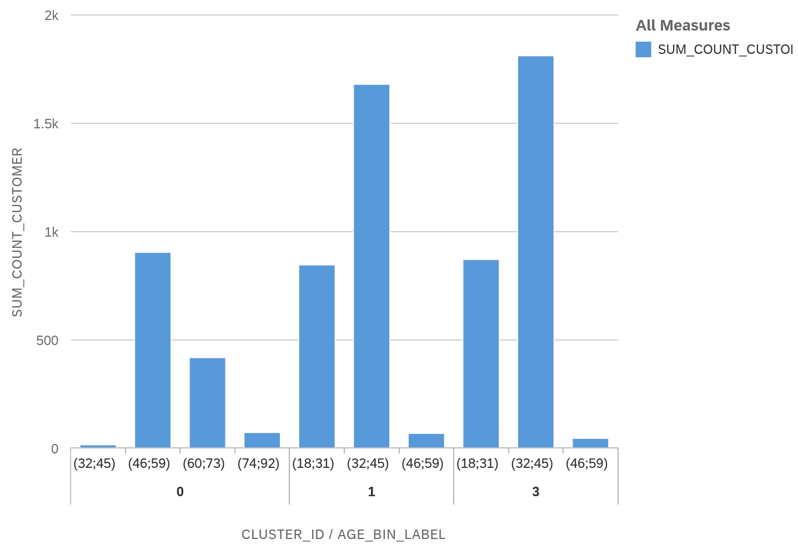

Erkennbar ist, dass in Cluster *0* die Altersgruppen *46-59*, *60-73* und *74-92* vertreten sind, in den Cluster *1* und *3* hingegen die Altersgruppen *18-31* und *32-45* dominieren.

Zum Vergleich kann man auch die Altersverteilung über die Gesamtheit der Kunden hinweg betrachten:

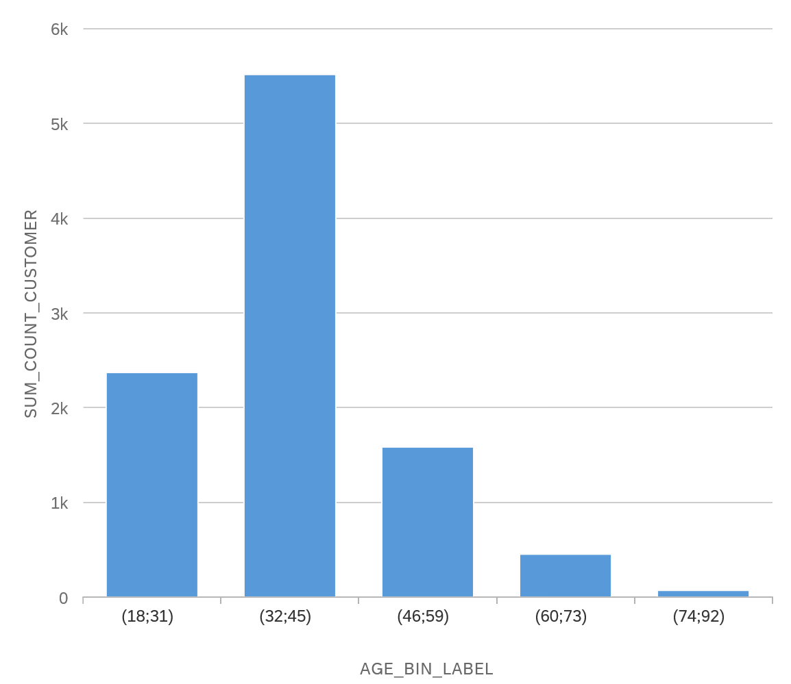

## Architektonische Betrachtungen - Data Spaces und HDI Container in SAP HANA

In diesem Kapitel möchte ich darauf eingehen, warum die Nutzung von Data Spaces und HDI Containern in SAP HANA hilfreich für den erfolgreichen Einsatz von Machine Learning ist.

Der Prozess zur Entwicklung von Machine-Learning-Modellen bzw. ML-gestützten Datenanalysen benötigt u.a. zwei Rahmenbedingungen:

- Zugriff auf produktive Echt-Daten - ggf. anonymisiert und historisiert.
- Möglichkeit zum Erstellen von HANA-Artefakten (Calculation Views, Stored Procedures, etc.) und dem Speichern von Zwischenergebnissen.

Die klassische Drei-System-Umgebung einer SAP-Landschaft aus Entwicklungssystem, Testsystem und Produktion ist für Machine-Learning daher nur mit Einschränkungen geeignet. 
Hier kommt die Nutzung von Spaces ins Spiel, die entweder nativ in SAP HANA oder in Datasphere angelegt werden können.
Ein Space ist eine isolierte Umgebung in HANA mit eigener Berechtigungsverwaltung und Steuerung der Ressourcennutzung. Beim Deployment eines HDI-Container wählt man aus, in welchen Space der Container deployed werden soll.

Die folgende Abbildung zeigt die Nutzung von Spaces im Kontext von Machine Learning:


Auf einem Produktionsystem kann ein eigener "Green space" für Machine Learning eingerichtet werden.
Dem Data Scientist bzw. Machine-Learning-Entwickler werden entsprechende Berechtigungen in diesem Green Space zugewiesen. 
Der blaue Kasten "Customer Data" symbolisiert hier die Kundendaten, die als Eingabedaten für die Cluster-Analyse verwendet werden.
Der Zugriff auf bereits vorhandene Daten wird durch entsprechende *External Services* bereit gestellt. Dies entspricht im Prinzip einem technischen Datenbankuser.
Durch die Beschränkung der CPU- und Speichernutzung des Green spaces wird verhindert, dass das Produktionssystem zu stark durch die Ausführung der Machine-Learning-Algorithmen belastet wird.

Für die Entwicklung von Datenbank-Artefakten sind die HDI-Container (in XSA oder HANA Cloud) ideal: 
- Jeder ML-Entwickler kann seine Entwicklung zunächst in einem eigenen Container deployen. 
- Zwischenergebnisse werden in Container-lokalen Tabellen gespeichert.

Das Zusammenführen von Entwicklungen kann dann zentral über ein Git-Repository erfolgen.

Sobald ein geeignetes Analyse-Vorgehen - bestehend aus Datenvorbereitung, Selektion der relevanten Features und einem geeignetem Cluster-Algorithmus - gefunden wurde, kann die Machine-Learning-Logik in einer Datenbank-Prozedur konsolidiert werden.
Prozedur und Calculation Views zur Auswertung können dann in den zentralen Produktions-Space deployed werden. Dort lässt sich die Cluster-Prozedur dann regelmäßig ausführen. Die Cluster-Ergebnisse stehen dann über die Calculation Views direkt für die Konsumierung im Reporting zur Verfügung.

Dank XSA lässt sich dieses Szenario auch in einem on-Premise-Umfeld ohne Data Sphere realisieren.

## Zusammenfassung

Das Zusammenfassen dieses Artikels überlasse ich chat-GPT (Smart GPT-5) - mit kleineren Korrekturen:

* Das SQL-Notebook im SAP Business Application Studio ermöglicht interaktive Datenanalysen mit SQLScript und bietet gegenüber der klassischen SQL-Konsole den Vorteil, Ergebnisse mehrerer Befehle strukturiert zu speichern.
* Anhand eines Datensatzes fiktiver Kunden wurde gezeigt, wie eine Cluster-Analyse mit dem K-Means-Algorithmus durchgeführt wird und die Ergebnisse in einer Tabelle persistiert werden können.
* Ergänzend lassen sich statistische Berechnungen wie Percentile und Mittelwerte direkt in SQLScript ausführen, um die Cluster detaillierter zu charakterisieren. 
* Mit Calculation Views können die Ergebnisse anschließend visuell aufbereitet werden, etwa durch Blasen- oder Streudiagramme sowie durch Techniken wie Binning zur Analyse von Altersgruppen. 
* Architektonisch spielen HDI-Container und Spaces in SAP HANA eine zentrale Rolle, da sie isolierte Umgebungen für Machine-Learning-Entwicklungen schaffen und den Zugriff auf produktive Daten sowie die Ressourcenkontrolle sicherstellen.


## Referenzen

[^churn]: Churn modeling von Kaggle: https://www.kaggle.com/datasets/shivan118/churn-modeling-dataset 
[^blog_calc_views]: https://www.brandeis.de/blog/2025-cluster-analysen-calculation-views/
[^thebook]: Mein Buch: https://es-tu.de/e9ZD2
[^git]: GitHub-Repository: https://github.com/drabap/SQLNotebookClustering 


